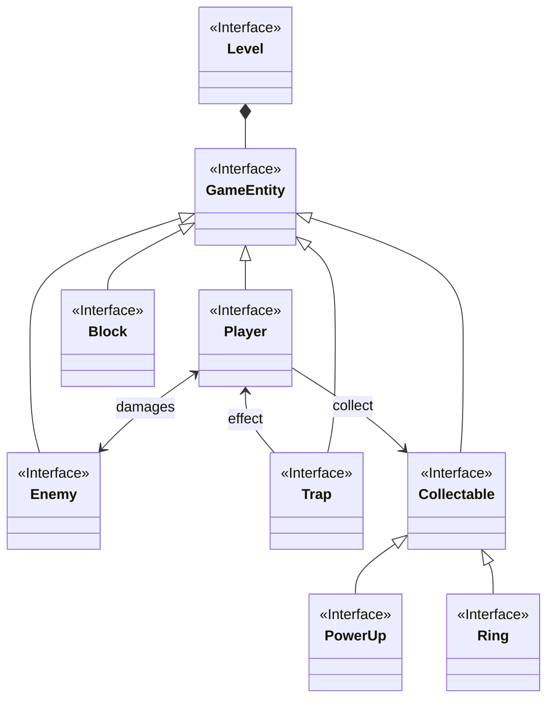
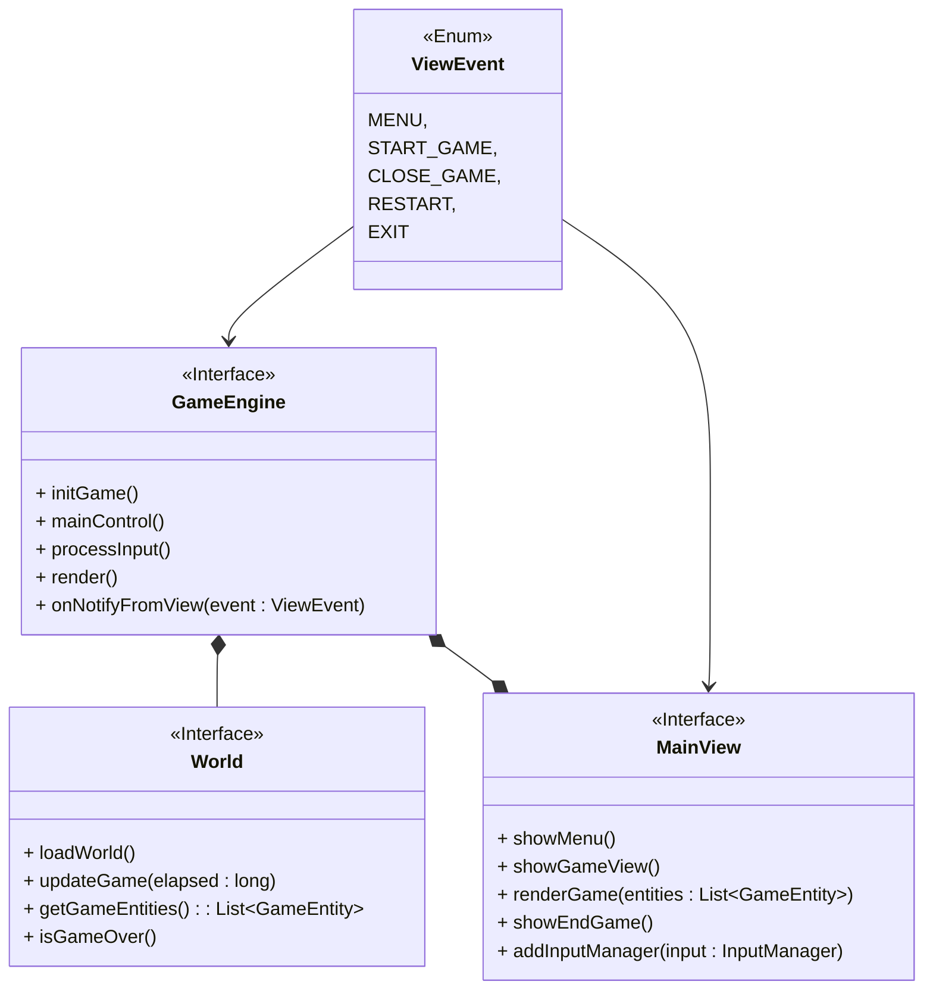
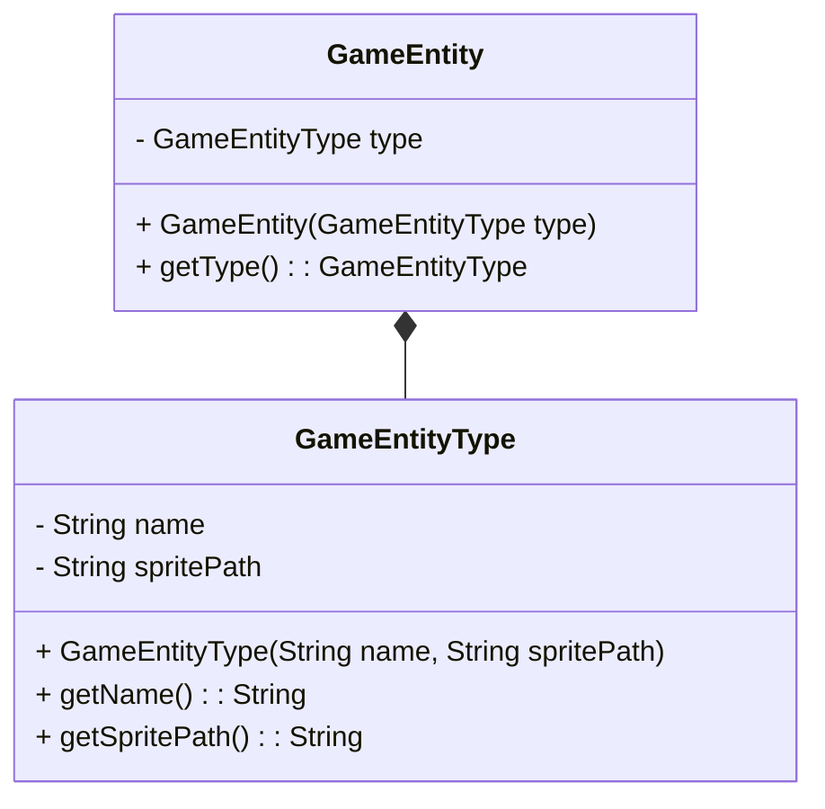
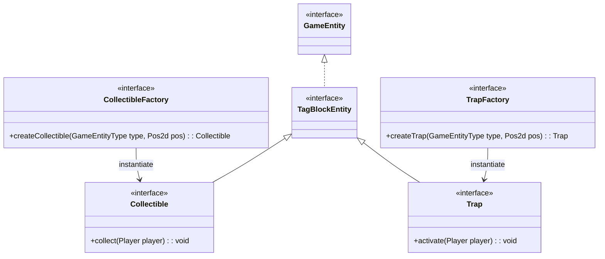
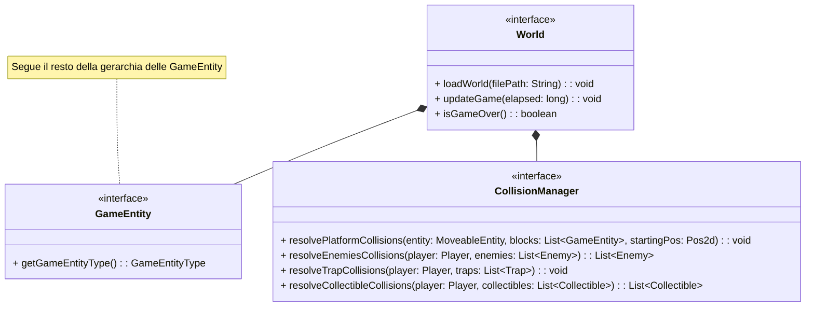

# Capitolo 1 - Analisi

## 1.1 Requisiti

Il software vuole riprendere il celebre videogioco 2d platform Super Sonic 1991. Il giocatore controlla Sonic, che dovrà superare nemici e ostacoli per arrivare alla fine del livello, raccogliendo più anelli possibili, e sfruttando diversi power-up che ne potenziano le capacità.

### Requisiti funzionali

- Il player deve:
    - poter muoversi verso destra, verso sinistra con velocità incrementale, e saltare
    - superare i blocchi e trappole tramite il salto
    - collezionare monete e ottenere power-ups che ne potenziano le abilità di gioco
    - sconfiggere i nemici attraverso il salto
- I nemici devono:
    - ostacolare il player facendogli perdere vita al contatto
    - potersi muovere verso destra e verso sinistra con una loro logica
- I power-up devono:
    - poter essere raccolti dal player
    - migliorarne una caratteristica (ad esempio aumentare la vita o conferire invulnerabilità)
- Le trappole devono:
    - far perdere vita al player quando avviene il contatto tra di essi
- La partita deve terminare quando il player raggiunge la bandierina di fine livello, o quando perde tutte le vite

### Requisiti non funzionali

- Dovrà essere presente un menù iniziale.
- Il gameplay dovrà risultare fluido (minimo 30 FPS).
- Il videogioco dovrà essere compatibile con la maggiorparte dei dispositivi e sistemi operativi.

## 1.2 Analisi e modello del dominio

Il giocatore ha modo di muoversi all'interno di una mappa, la quale si compone di blocchi non compenetrabili, trappole, nemici, oggetti raccoglibili e bandierina di fine livello.
Sonic può collezionare monete per incrementare il punteggio della partita, raccogliere power-ups per potenziarsi e sconfiggere nemici tramite l'abilità di salto. Inoltre deve riuscire ad arrivare alla bandierina di fine livello per terminare la partita.
Insieme a Sonic, si muovono nella mappa i nemici, seguendo una logica prestabilita. Quando un nemico colpisce il personaggio, quest'ultimo subisce danno, decrementando la propria salute. Se la vita del giocatore arriva a 0, la partita finisce.
Nella mappa sono sparse delle trappole, che al contatto con Sonic, gli provocano qualche tipo di effetto, per esempio un danno o un effetto "trampolino".

# Capitolo 2 - Design

## 2.1 Architettura

Per la realizzazione di questo applicativo si è utilizzato il pattern architetturale MVC. La classe `GameEngine` funge da controller, che ha il compito di fare da mediatore tra la view e il model, e di gestire il loop principale di gioco. Esso riceve gli input dalla view tramite la classe `InputManager` e li passa al model (classe `World`). Successivamente il controller passa le liste con le entità di gioco alla view (classe `MainView`) per farle renderizzare.
Il model ha il compito di gestire la logica di gioco e di aggiornare la posizione/stato delle entità. La view ha il compito di renderizzare le entità di gioco e di visualizzare i menù di inizio e fine partita. Inoltre la view comunica con il controller attraverso l'enum `ViewEvent` per gestire gli eventi che si verificano nella view che devono avere una conseguenza nel controller: ad esempio dopo il click del bottone "Play" del menù principale deve iniziare il livello, oppure dopo il click sul bottone “Quit" di fina partita, il programma deve terminarsi.
Grazie all'utilizzo di MVC abbiamo definito degli entry-point per model e view (`World` e `MainView`) ben chiari, rendendo facile la sostituzione in blocco della view, o addirittura rendendo possibile la gestione di più view contemporaneamente.

## 2.2 Design dettagliato

### Bagnolini Matteo

### Gerarchia di entità di gioco

**Problema:** Gestire la definizione di varie entità di gioco, dotate di caratteristiche differenti. Si vuole minimizzare la ripetizione di codice e garantire estendibilità per future modifiche e feature aggiuntive.

**Soluzione:** Per gestire la definizione delle entità di gioco ho voluto utilizzare il pattern Composite, che permette di creare una gerarchia di classi. Si definisce quindi una struttura ad albero, dove la radice è `AbstractGameEntity`. Questa classe modella una generica entità di gioco, che può essere specializzata in blocco, collezionabile o `AbstractMoveableEntity`. Una `AbstractMoveableEntity` rappresenta una generica entità che può muoversi nella mappa di gioco, come ad esempio il personaggio principale e i nemici (che rappresentano le foglie dell'albero).
In questo modo ho ridotto la ripetizione di codice non necessario, poichè le classi "foglia" avrebbe dovuto implementare molti metodi uguali tra di loro, e permetto di avere una buona estendibilità. Ad esempio per creare una nuova entità dotata di movimento (come un boss) è necessario solamente estendere la classe `AbstractMoveableEntity` ed aggiungere il codice dove si specificano funzionalità aggiuntive specifiche.

### Movimento delle entità

**Problema:** Ogni `MoveableEntity` deve potersi muovere, e ogni entità dovrebbe avere la sua logica di movimento.

**Soluzione:** Per gestire il movimento delle entità ho utilizzato il pattern template method all'interno della classe astratta `AbstractMoveableEntity`. In questa classe ho infatti definito un metodo astratto `updateVelocity()`, che viene chiamato all'interno del template method `move()`. In questo modo, quando si va a definire una classe concreta che estende `AbstractMoveableEntity`, si deve andare a specificare la logica con cui viene aggiornata la velocità dell'entità. In questo modo si rende possibile il riuso del codice per entità che si muovono ognuna con una propria logica differente.

**Problema:** Ogni `MoveableEntity` dovrebbe avere una propria fisica di gioco specifica. Inoltre si vuole separare la gestione della fisica dall'entità stessa per avere più modularità del codice.

**Soluzione:** Per risolvere questo problema ho voluto utilizzare il pattern Component. Ho definito quindi una classe `Physics` che modella la fisica di gioco utilizzando dei valori (ad esempio forza di gravità, velocità massima, accelerazione e decelerazione, ecc..) che vengono specificati alla creazione dell'oggetto. Ogni `MoveableEntity` ha come attributo un'istanza di `Physics` personalizzata  (cioè con valori che possono essere differenti da entità a entità), chiamato `physicsComponent`, che utilizza per aggiornare la propria velocità nel metodo `updateVelocity()` descritto sopra. In questo modo ogni entità movibile può avere la propria fisica di gioco personalizzata. Inoltre si rende il codice più modulare e manutenibile poichè si delega a un oggetto secondario il compito di aggiornare la velocità dell'entità secondo una specifica logica.

### Gestione delle collisioni

**Problema:** Bisogna gestire le collisioni tra il giocatore e le entità di gioco. Ogni entità con cui il giocatore collide provoca effetti differenti.

**Soluzione:** Per gestire le collisioni ho utilizzato il pattern Observer: la classe `CollisionResolver` funge da osservabile, che viene osservato da `PlayerManagerImpl`. Dopo ogni collisione tra il giocatore e specifiche entità di gioco (come blocchi e nemici), `CollisionResolver` notifica a `PlayerManagerImpl` l'evento (un enum di tipo `CollisionEvent`). Questo evento viene poi gestito tramite la specifica routine all'interno della classe manager, la quale modifica lo stato di `Player` in base al tipo di collisione. Ho voluto implementare questo pattern sia per rendere più manutenibile il codice, sia per renderlo aperto a future modifiche e migliorie. Ad esempio l'observer potrebbe essere usato per aggiungere elementi sonori al gioco semplicemente creando una classe che osserva il `CollisionResolver` e definendo delle specifiche subroutine per ogni evento.

### Stato del giocatore

**Problema:** Bisogna trovare un modo per rappresentare lo stato interno del giocatore, rappresentato dai vari campi della classe `Player`, tramite una classe apposita. Inoltre si vuole trovare un modo per creare istanze di questa classe in maniera linguisticamente efficiente.

**Soluzione:** Ho creato una classe `PlayerState` che rappresenta lo stato del giocatore (velocità, flag di movimento e altre info). In questo modo quando una classe esterna dovrà interfacciarsi con il giocatore (sia per avere informazioni sia per modificare lo stato) lo farà tramite i metodi `getState()` e `setState()`, rendendo i vari campi di `Player` invisibili.
La mia idea originale era di utilizzare uno [pseudo-builder](https://github.com/matteobagnolini/OOP23-SUPSON/blob/ff92ee9dbcf9d68474e429ec77a5ead622a2a205/src/main/java/supson/model/entity/player/PlayerState.java) per rendere più facile la creazione di una nuova istanza di `PlayerState` partendo da quella precedente (simulando i "copy constructor" di C++), tuttavia il codice risultava troppo pesante, e dopo essermi confrontato con il prof. Pianini ho optato per una soluzione più leggera e leggibile che utilizza metodi concatenabili e il cui risultato è simile alla modifica di un oggetto `PlayerState` già esistente.

### Massari Filippo

### Gestione e riconoscimento delle entità di gioco

**Problema:** Nel contesto del gioco, sono presenti diverse entità con caratteristiche e comportamenti distinti. Queste entità devono essere rappresentate in modo coerente all'interno del modello di gioco, della sua rappresentazione visiva e dell'interazione con il giocatore. Tuttavia, la gestione di queste entità può diventare complessa a causa delle loro diverse proprietà e comportamenti.

**Soluzione:** Per affrontare questo problema e garantire una gestione efficace delle entità di gioco, abbiamo introdotto l'enum `GameEntityType`. Questo enum fornisce una rappresentazione univoca di ciascuna entità di gioco, associandole a un tipo specifico che comprende informazioni cruciali come il percorso dello sprite associato e l'indice identificativo. Utilizzando GameEntityType siamo in grado di stabilire una corrispondenza diretta tra le classi istanziate nel gioco e le loro rappresentazioni visive e funzionali. Questo semplifica notevolmente la gestione delle entità nel modello di gioco, consentendo una maggiore coerenza e facilitando lo sviluppo e la manutenzione del codice.

### Gerarchia dei Blocchi del Gioco

**Problema:** Nel nostro gioco abbiamo diversi tipi di blocchi con comportamenti differenti sia dalle restanti entità di gioco che tra loro stessi. Alcuni blocchi possono essere raccolti dai giocatori mentre altri rappresentano trappole o semplicemente ostacoli. È necessario un sistema flessibile che permetta di gestire questi diversi comportamenti senza duplicare il codice e facilitando l'estensibilità futura.

**Soluzione:** Abbiamo progettato una gerarchia di interfacce per i blocchi del gioco. Questa gerarchia utilizza i design pattern Factory e Strategy per creare oggetti e definire comportamenti intercambiabili. Le interfacce principali sono `GameEntity`, `TagBlockEntity`, `Collectible`, `Trap`, `CollectibleFactory` e `TrapFactory`. `GameEntity` è l'interfaccia di base per tutte le entità di gioco, essa viene estesa, attraverso l'uso del marker interface pattern, dalla tag interface `TagBlockEntity` che va a dividere in maniera netta le moveable entity dai block entity evitando così possibili ambigutà. Essa rappresnta dunque tutti gli elementi statici all'interno del gioco. `Collectible` estende `TagBlockEntity` e rappresenta blocchi che possono essere raccolti.`Trap` estende `BlockEntity` e rappresenta blocchi che se attivati possono indurre un effetto negativo sul giocatore.`CollectibleFactory` fornisce un metodo per creare oggetti `Collectible` ed allo stesso modo `TrapFactory` gestisce la creazione di più tipi di trappole con effetti differenti.
Attraverso l'utilizzo di tale gerarchia di interfacce risulta molto semplice arrichire il gioco con nuovi racchoglibili e nuove trappole, infatti non sarà richiesta l'implentazione di nuove classi, e relativa gestione capillare, ma semplicemente si andranno ad implementare nuovi metodi all'interno delle factory.

### Gestione centralizzata del mondo di gioco

**Problema:** Gestione del mondo di gioco, in particolar modo il riconoscimento, la distinzione e l'interazione tra entità di gioco

**Soluzione:** Il mondo è rappresentato da un'interfaccia `World` essa presenta metodi utili ad istaziare, aggiornare e confrontare tutte le entità di gioco, essa si serve dell'enum `GameEntityType` per istanziare le entità di gioco attraverso l'utilizzo delle factory, distinguerle tra loro e gestirne le iterazioni attraverso il pattern observer implementato grazie al cunnubio di `CollisionManager` e `PlayerManager`. Il compito pricipale dell'interfaccia `World`, ovvero quello di gestire il caricamento del mondo, è realizzato dall'interfaccia `WorldLoader`. La gestione di quest'ultima separatamente, adottanto dunque il pattern strategy, e ed in sinergia con il pattern factory ne permentto una migliore chiarezza, semplicità, manutenibiltà ed espandibiltà.

### Gestione consequenziale e differenziata degli effetti dei power-up timerizzati

**Problema:** I power-up dotati di timer hanno una routine di gestione pressochè sempre identica che se gestita in maniera errata potrebbe condurre a malfuzionamenti dovuti ad una sovrapposizione di queti ultimi.

**Soluzione:** Per gestire in modo corretto gli effetti dei power-up timerizzati, abbiamo pensato un sistema di gestione sequenziale e differenziata, grazie all'interfaccia `CollectableEffect` che permette di ridurre la ripetizione di codice e rende altamente scalabile l'aggiunta futura di power-up dichiarando una factory di effetti che andrà a coadiuvare il lavoro di `CollectableFactory`.

# Capitolo 3 - Sviluppo

## 3.1 Testing automatizzato

- TestPlayer: viene testato che il giocatore si muova effettivamente una volta impostati i vari flag `right`, `left` e `jump`. Inoltre vengono testati i metodi setters relativi allo score e alle vite.

- TestPhysics: vengono testati i vari metodi della classe `PhysicsImpl` utilizzando delle classi `MoveableEntity` fittizie (dove viene specificato il metodo `updateVelocity()`). In particolare viene testato il corretto movimento con accelerazione, la frizione con il terreno di gioco, il salto e la forza di gravità.

- TestHitbox: viene controllato che gli angoli dell'hitbox vengano calcolati correttamente quando si chiamano i relativi getters. Inoltre viene testato il metodo `isCollidingWith(Hitbox other)`, usato per controllare se due hitbox collidono tra di loro.

- TestCollectable: Questa classe contiene i test per la creazione e l'uso dei vari oggetti collezionabili, verifica l'effettiva creazione dell'oggetto e che il suo effetto all'attivazione sia coerente con ciò che ci si aspetta.
Viene anche verificata la casistica in cui si tenta di creare un collezionabile non valido (ad esempio di tipo ENEMY) e la conseguente generazione di un'eccezione IllegalArgumentException.

- TestGameTimerImpl: Questa classe contiene i test per la classe che rappresenta il timer di gioco. I test verificano le effettiva funzionalità del timer come l'avvio, lo stop ed il reset, inoltre contralano l'effettiva coerenza del tempo trascorso con quello riportato dal timer.

- TestStrengthPowerUpEffectImpl: Questa classe contiene i test per la che rappresenta l'effetto timerizzato del power-up di invulnerabilità. Verifica che l'effetto venga attivato e terminato correttamente dopo la durata specificata, rendendo il giocatore invulnerabile per quel periodo, controlla inltre che l'effetto rispetti lo stato di invulnerabilità iniziale del giocatore, aspettando se il giocatore è già invulnerabile e dunque già in possesso di un power-up similare.

- TestWorld: Questa classe contiene i test per il mondo di gioco. Va dunque a testare l'aggiunta e la rimozione di elementi di gioco dal mondo stesso ed i relativi getter sia sulle singole istanze che sulle strutture dati in esso contenute.

## 3.2 Note di sviluppo

### Bagnolini Matteo

- Utilizzo di classi record per immutabili:
    - https://github.com/matteobagnolini/OOP23-SUPSON/blob/master/src/main/java/supson/common/impl/Pos2dImpl.java
    - https://github.com/matteobagnolini/OOP23-SUPSON/blob/master/src/main/java/supson/model/entity/impl/moveable/player/PlayerState.java

- Utilizzo di stream e lambda (ne riporto qualche esempio):
    - https://github.com/matteobagnolini/OOP23-SUPSON/blob/3456aa6260d29f44b60f5730526b85bd11b8dbbe/src/main/java/supson/model/collisions/impl/CollisionResolver.java#L109-L113
    - https://github.com/matteobagnolini/OOP23-SUPSON/blob/3456aa6260d29f44b60f5730526b85bd11b8dbbe/src/main/java/supson/model/collisions/impl/CollisionResolver.java#L101-L105

- Codice reperito online: per farmi un'idea di come potesse funzionare la fisica di movimento all'interno del videogioco originale ho consultato [questo sito](https://info.sonicretro.org/SPG:Running)

### Massari Filippo

- Utilizzo del costrutto Function: 

    - https://github.com/matteobagnolini/OOP23-SUPSON/blob/b0da638214d4a25d83404a5f30eb88820b4a7f4a/src/main/java/supson/model/entity/impl/block/collectible/CollectibleFactoryImpl.java#L21
    - https://github.com/matteobagnolini/OOP23-SUPSON/blob/b0da638214d4a25d83404a5f30eb88820b4a7f4a/src/main/java/supson/model/entity/impl/block/collectible/CollectibleFactoryImpl.java#L29-L44

- Utilizzo multiplo del costrutto Optional, ne riporto qualche esempio: 
    - https://github.com/matteobagnolini/OOP23-SUPSON/blob/c405d3f4a2e9ed6e36d0be02aa59c9690faf051d/src/main/java/supson/model/world/impl/WorldLoaderImpl.java#L78-L83
    - https://github.com/matteobagnolini/OOP23-SUPSON/blob/c405d3f4a2e9ed6e36d0be02aa59c9690faf051d/src/main/java/supson/view/impl/world/WorldImageManagerImpl.java#L37-L48

- Utilizzo multipolo del costrutto Method References, ne riporto qualche esempio: 
    - https://github.com/matteobagnolini/OOP23-SUPSON/blob/c405d3f4a2e9ed6e36d0be02aa59c9690faf051d/src/main/java/supson/model/entity/impl/block/collectible/CollectibleFactoryImpl.java#L29-L34
    - https://github.com/matteobagnolini/OOP23-SUPSON/blob/c405d3f4a2e9ed6e36d0be02aa59c9690faf051d/src/main/java/supson/view/impl/world/WorldViewImpl.java#L67-L69

- Utilizzo multiplo del costrutto Stream, ne riporto qualche esempio:
    - https://github.com/matteobagnolini/OOP23-SUPSON/blob/c405d3f4a2e9ed6e36d0be02aa59c9690faf051d/src/main/java/supson/model/world/impl/WorldLoaderImpl.java#L48-L50
    - https://github.com/matteobagnolini/OOP23-SUPSON/blob/c405d3f4a2e9ed6e36d0be02aa59c9690faf051d/src/main/java/supson/view/impl/world/WorldViewImpl.java#L67-L69

- Utilizzo multiplo dei Thread, ne riporto qualche esempio:
    - https://github.com/matteobagnolini/OOP23-SUPSON/blob/0cc4acde04ec467078dbdbfa45ca81a320406337/src/main/java/supson/model/effect/impl/AbstractCollectibleEffect.java#L44-L66
    - !!!

- Codice reperito online: 
    - Non sapevo come usare il logger in maniera appropriata ed ho guardato i metodi principali su [questo sito](https://www.geeksforgeeks.org/logger-getlogger-method-in-java-with-examples/).

# Capitolo 4 - Commenti finali

## 4.1 Autovalutazione e lavori futuri

### Bagnolini Matteo
Sono in generale soddisfatto di come è stato realizzato questo progetto. Sono riuscito ad utilizzare abbastanza design pattern noti rendendo il codice piuttosto estendibile. Il mio ruolo è stata la gestione delle principali entità di gioco, in particolare quelle dotate di movimento, e credo di aver gestito bene questo compito. Il codice scritto è molto aperto ad estensioni, e questo penso sia dovuto a un buon lavoro di analisi iniziale, che ha semplificato la costruzione di tutto il progetto. Infatti non abbiamo avuto particolari problemi, anche perchè avendo deciso di consegnare il progetto durante la sessione estiva, abbiamo avuto tutto il tempo necessario per lo sviluppo. Ho cercato di essere il più disponibile possibile con gli altri membri, cercando di aiutarli quando comparivano difficoltà. Tuttavia credo che non ci sia stato pari impegno da parte di tutti i partecipanti del gruppo, anche se questo non ha impedito di realizzare le feature obligatorie previste.
Per quanto riguarda il futuro di questo progetto credo che possa essere interessante cercare di aggiungere altri elementi come trappole, livelli e nemici, anche se attualmente non è la mia priorità. Queste cose sono facilmente implementabili grazie a un buon design generale.

# Appendice A - Guida utente

Comandi:

- Per avviare la partita premere il bottone Start nel menù principale.
- Per muoversi a destra e a sinistra bisogna premere le rispettive frecce, o usare i tasti A-D.
- Per saltare bisogna premere il tasto SPACE.

# Appendice B - Esercizi di laboratorio

## B.0.1 matteo.bagnolini5@studio.unibo.it
- Laboratorio 07: https://virtuale.unibo.it/mod/forum/discuss.php?d=147598#p209372
- Laboratorio 08: https://virtuale.unibo.it/mod/forum/discuss.php?d=148025#p209972
- Laboratorio 09: https://virtuale.unibo.it/mod/forum/discuss.php?d=149231#p211626
- Laboratorio 11: https://virtuale.unibo.it/mod/forum/discuss.php?d=151542#p213969

