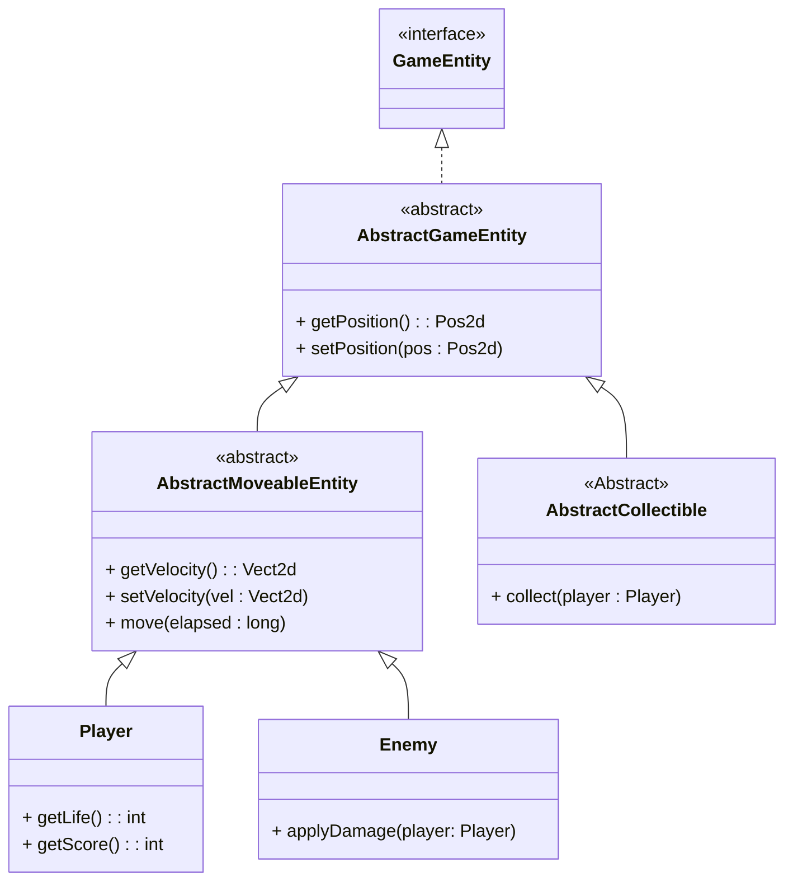
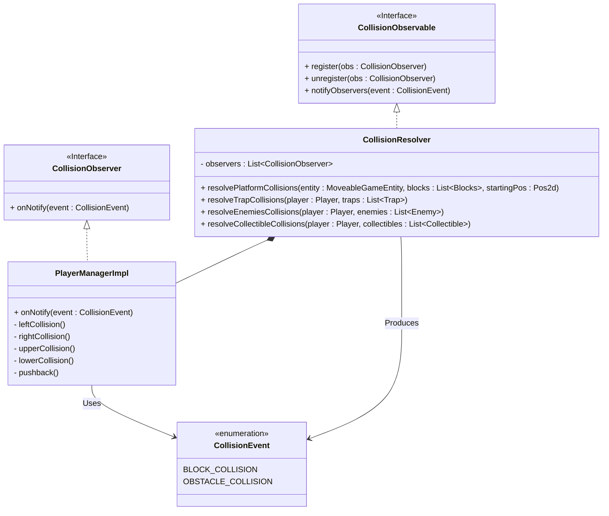
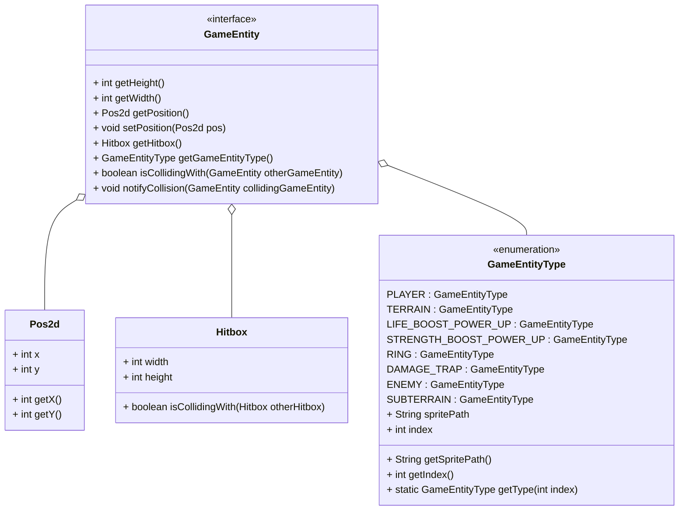
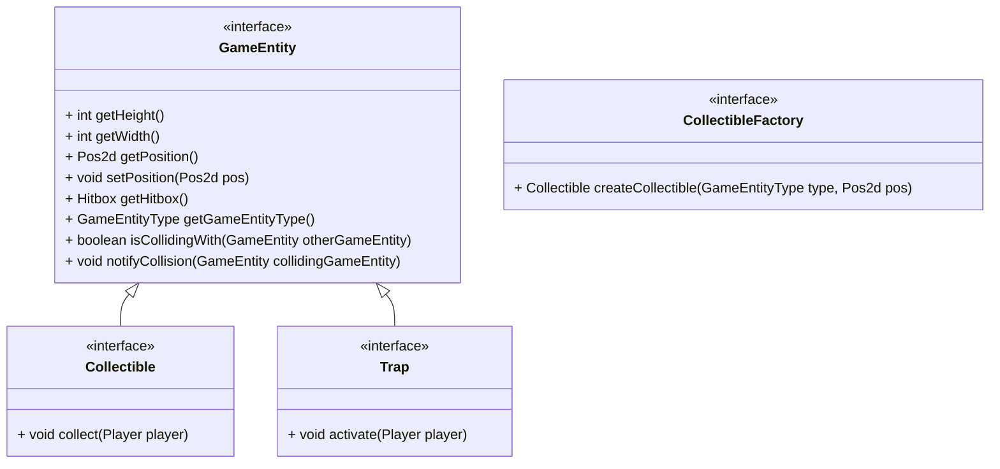
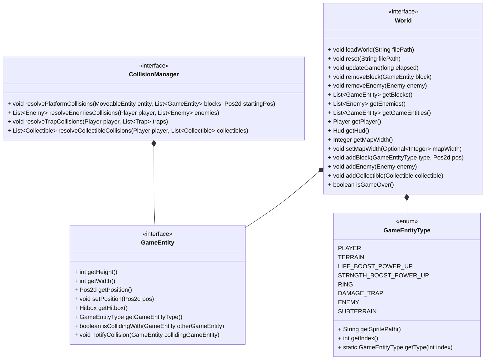
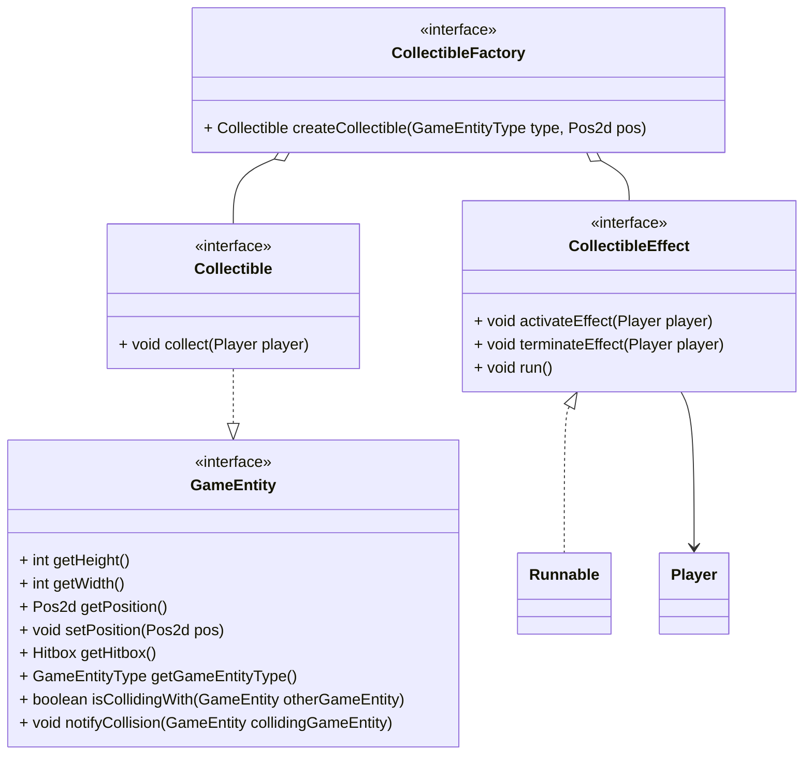

# Capitolo 1 - Analisi
## 1.1 Requisiti
Il software vuole riprendere il celebre videogioco 2d platform Super Sonic 1991. Il giocatore controlla Sonic, che dovrà superare nemici e ostacoli per arrivare alla fine del livello, raccogliendo più anelli possibili, e sfruttando diversi power-up che potenziano Sonic.
### Requisiti funzionali
!!
- Il player deve:
    - poter muoversi verso destra, verso sinistra con velocità incrementale, e saltare
    - collezionare monete e ottenere power-ups che ne potenziano le abilità di gioco
    - sconfiggere i nemici attraverso il salto
- I nemici devono:
    - ostacolare il player facendogli perdere vita al contatto
    - potersi muovere verso destra e verso sinistra con una loro logica
- 
### Requisiti non funzionali
!!
- Menù iniziale
- Il gameplay dovrà risultare fluido
- Il videogioco dovrà essere compatibile con la maggiorparte dei dispositivi e sistemi operativi
## 1.2 Analisi e modello del dominio
Il giocatore ha modo di muoversi all'interno di una mappa, la quale si compone di blocchi non compenetrabili, trappole, nemici e oggetti raccoglibili.
Sonic può collezionare monete per incrementare il punteggio della partita, raccogliere power-ups per potenziarsi e sconfiggere nemici tramite l'abilità di salto.
Insieme a Sonic, si muovono nella mappa i nemici, seguendo una logica prestabilita. Quando un nemico colpisce il personaggio, quest'ultimo subisce danno, decrementando la propria salute.
Nella mappa sono sparse delle trappole, che al contatto con Sonic, gli provocano qualche tipo di effetto, per esempio un danno oppure un effetto di qualche tipo.

# Capitolo 2 - Design
!!
## 2.1 Architettura
!!
## 2.2 Design dettagliato
### Bagnolini Matteo
### Gerarchia di entità di gioco

**Problema:** Gestire la definizione di varie entità di gioco, dotate di caratteristiche differenti. Si vuole minimizzare la ripetizione di codice e garantire estendibilità per future modifiche e feature aggiuntive.

**Soluzione:** Per gestire la definizione delle entità di gioco ho voluto utilizzare il pattern Composite, che permette di creare una gerarchia di classi. Si definisce quindi una struttura ad albero, dove la radice è `AbstractGameEntity`. Questa classe modella una generica entità di gioco, che può essere specializzata in blocco, anello e power-up (foglie dell'albero) e `AbstractMoveableEntity`. Una `AbstractMoveableEntity` rappresenta una generica entità che può muoversi nella mappa di gioco, come ad esempio il personaggio principale e i nemici (foglie dell'albero).
In questo modo ho ridotto la ripetizione di codice non necessario, poichè le classi "foglia" avrebbe dovuto implementare tutti metodi uguali tra di loro, e permetto di avere una buona estendibilità. Ad esempio per creare una nuova entità dotata di movimento (come un boss) è necessario solamente estendere la classe `AbstractMoveableEntity` ed aggiungere il codice dove si specificano le funzionalità aggiuntive della nuova entità.

### Movimento delle entità

**Problema:** Ogni `MoveableEntity` deve potersi muovere, e ogni entità dovrebbe avere la sua logica di movimento.

**Soluzione:** Per gestire il movimento delle entità ho utilizzato il pattern template method all'interno della classe astratta `AbstractMoveableEntity`. In questa classe ho infatti definito un metodo astratto `updateVelocity()`, che viene chiamato all'interno del template method `move()` della classe stessa. In questo modo, quando si va a definire una classe concreta che estende `AbstractMoveableEntity`, si deve andare a specificare la logica con cui viene aggiornata la velocità dell'entità. In questo modo si rende possibile il riuso del codice per entità che si muovono ognuna con una propria logica differente.

**Problema:** Ogni `MoveableEntity` dovrebbe avere una propria fisica di gioco specifica. Inoltre si vuole separare la gestione della fisica dall'entità stessa per avere più modularità del codice.

**Soluzione:** Per risolvere questo problema ho voluto utilizzare il pattern Component. Ho definito quindi una classe `Physics` che modella la fisica di gioco utilizzando dei valori (ad esempio forza di gravità, velocità massima, accelerazione e decelerazione, ecc..) che vengono specificati alla creazione dell'oggetto. Ogni `MoveableEntity` ha come attributo un'istanza di `Physics` personalizzata  (cioè con valori che possono essere differenti da entità a entità) che utilizza per aggiornare la propria velocità nel metodo `updateVelocity()` descritto sopra. In questo modo ogni entità movibile può avere la propria fisica di gioco personalizzata. Inoltre si rende il codice più modulare e manutenibile poichè si delega a un oggetto secondario il compito di aggiornare la velocità dell'entità secondo una specifica logica.

### Gestione delle collisioni

**Problema:** Bisogna gestire le collisioni tra il giocatore e le entità di gioco. Ogni entità con cui il giocatore collide provoca effetti differenti.

**Soluzione:** Per gestire le collisioni ho utilizzato il pattern Observer: la classe `CollisionResolver` funge da osservabile, che viene osservato da `PlayerManagerImpl`. Dopo ogni collisione tra il giocatore e specifiche entità di gioco (come blocchi e nemici), `CollisionResolver` notifica a `PlayerManagerImpl` l'evento (un enum di tipo `CollisionEvent`). Questo evento viene poi gestito tramite la specifica routine all'interno della classe manager. Ho voluto implementare questo pattern sia per rendere più manutenibile il codice, sia per renderlo aperto a future modifiche e migliorie. Ad esempio l'observer potrebbe essere usato per aggiungere elementi sonori al gioco semplicemente creando una classe che osserva il `CollisionResolver` e definendo delle specifiche subroutine per ogni evento.

### Stato del giocatore

**Problema:** Bisogna trovare un modo per rappresentare lo stato interno del giocatore, rappresentato dai vari campi della classe `Player`, tramite una classe apposita. Inoltre si vuole trovare un modo per creare istanze di questa classe in maniera linguisticamente efficiente.

**Soluzione:** Ho creato una classe `PlayerState` che rappresenta lo stato del giocatore (velocità, flag di movimento e altre info). In questo modo quando una classe esterna dovrà interfacciarsi con il giocatore (sia per avere informazioni sia per modificare lo stato) lo farà tramite i metodi `getState()` e `setState()`, rendendo i vari campi di `Player` invisibili.
La mia idea originale era di utilizzare uno [pseudo-builder](https://github.com/matteobagnolini/OOP23-SUPSON/blob/ff92ee9dbcf9d68474e429ec77a5ead622a2a205/src/main/java/supson/model/entity/player/PlayerState.java) per rendere più facile la creazione di una nuova istanza di `PlayerState` partendo da quella precedente (simulando i "copy constructor" di C++), tuttavia il codice risultava troppo pesante, e dopo essermi confrontato con il prof. Pianini ho optato per una soluzione più leggera e leggibile che utilizza metodi concatenabili e il cui risultato è simile alla modifica di un oggetto `PlayerState` già esistente.

### Massari Filippo

### Gestione e riconoscimento delle entità di gioco

**Problema:** Nel contesto del gioco, sono presenti diverse entità con caratteristiche e comportamenti distinti. Queste entità devono essere rappresentate in modo coerente all'interno del modello di gioco, della sua rappresentazione visiva e dell'interazione con il giocatore. Tuttavia, la gestione di queste entità può diventare complessa a causa delle loro diverse proprietà e comportamenti.

**Soluzione:** Per affrontare questo problema e garantire una gestione efficace delle entità di gioco, abbiamo introdotto l'enum `GameEntityType`. Questo enum fornisce una rappresentazione univoca di ciascuna entità di gioco, associandole a un tipo specifico che comprende informazioni cruciali come il percorso dello sprite associato e l'indice identificativo. Utilizzando GameEntityType in sinergia con `Pos2d` e `Hitbox`, siamo in grado di stabilire una corrispondenza diretta tra le classi istanziate nel gioco e le loro rappresentazioni visive e funzionali. Questo semplifica notevolmente la gestione delle entità nel modello di gioco, consentendo una maggiore coerenza e facilitando lo sviluppo e la manutenzione del codice.

### Gerarchia dei Blocchi del Gioco

**Problema:** Nel nostro gioco, abbiamo diversi tipi di blocchi con comportamenti differenti. Alcuni blocchi possono essere raccolti dai giocatori, mentre altri rappresentano trappole che influenzano il giocatore. È necessario un sistema flessibile che permetta di gestire questi diversi comportamenti senza duplicare il codice e facilitando l'estensibilità futura.

**Soluzione:** Abbiamo progettato una gerarchia di interfacce per i blocchi del gioco. Questa gerarchia utilizza i design pattern Factory e Strategy per creare oggetti e definire comportamenti intercambiabili. Le interfacce principali sono `GameEntity`, `Collectible`, `Trap` e `CollectibleFactory`. `GameEntity` è l'interfaccia di base per tutti i blocchi, raccoglibili e non raccoglibili che comongono il mondo di gioco. `Collectible` estende `BlockEntity` e rappresenta blocchi che possono essere raccolti.`Trap` estende `BlockEntity` e rappresenta blocchi che possono attivare trappole.`CollectibleFactory` fornisce un metodo per creare oggetti `Collectible`.Sebbene non esista, data l'assenza di una molteplicità effettiva di trappole, sarrebbe stato nei nostri piani realizzare anche un'interfaccia `TrapFactory` per gestire la creazione di più tipi di trappole con effetti differenti.
Attraverso l'utilizzo di tale gerarchia di interfacce risulta molto semplice arrichire il gioco con nuovi racchoglibili e nuove trappole, infatti non sarà richiesta l'implentazione di nuove classi, e relativa gestione capillare, ma semplicemente si andranno ad implementare nuovi metodi all'interno delle factory.

### Gestione centralizzata del mondo di gioco

**Problema:** Gestione del mondo di gioco, in particolar modo il riconoscimento, la distinzione e l'interazione tra entità di gioco

**Soluzione:** Il mondo è rappresentato da un'interfaccia `World` essa presenta metodi utili ad istaziare, aggiornare e confrontare tutte le entità di gioco, essa si serve dell'enum `GameEntityType` per istanziare le entità di gioco attraverso l'utilizzo delle factory, distinguerle tra loro e gestirne le iterazioni attraverso il puttern observer implementato grazie al cunnubio di `CollisionManager` e `PlayerManager`. Il compito pricipale dell'interfaccia `World`, ovvero quello di gestire il caricamento del mondo, è realizzato dall'interfaccia `WorldLoader`. La gestione di quest'ultima separatamente, adottanto dunque il puttern strategy, e ed in sinergia con il puttern factory ne permentto una migliore chiarezza, semplicità, manutenibiltà ed espandibiltà.

### Gestione consequenziale e differenziata degli effetti dei power-up timerizzati

**Problema:** I power-up dotati di timer hanno una routine di gestione pressochè sempre identica che se gestita in maniera errata potrebbe condurre a malfuzionamenti dovuti ad una sovrapposizione di queti ultimi.

**Soluzione:** Per gestire in modo corretto gli effetti dei power-up timerizzati, abbiamo pensato un sistema di gestione sequenziale e differenziata, grazie all'interfaccia `CollectableEffect` che permette di ridurre la ripetizione di codice e rende altamente scalabile l'aggiunta futura di power-up dichiarando una factory di effetti che andrà a coadiuvare il lavoro di `CollectableFactory`.

# Capitolo 3 - Sviluppo

## 3.1 Testing automatizzato

- TestPlayer: viene testato che il giocatore si muova effettivamente una volta impostati i vari flag `right`, `left` e `jump`. Inoltre vengono testati i metodi setters relativi allo score e alle vite.
- TestPhysics: vengono testati i vari metodi della classe `PhysicsImpl` utilizzando delle classi `MoveableEntity` fittizie (dove viene specificato il metodo `updateVelocity()`). In particolare viene testato il corretto movimento con accelerazione, la frizione con il terreno di gioco, il salto e la forza di gravità.
- TestHitbox: viene controllato che gli angoli dell'hitbox vengano calcolati correttamente quando si chiamano i relativi getters. Inoltre viene testato il metodo `isCollidingWith(Hitbox other)`, usato per controllare se due hitbox collidono tra di loro.

## 3.2 Note di sviluppo

